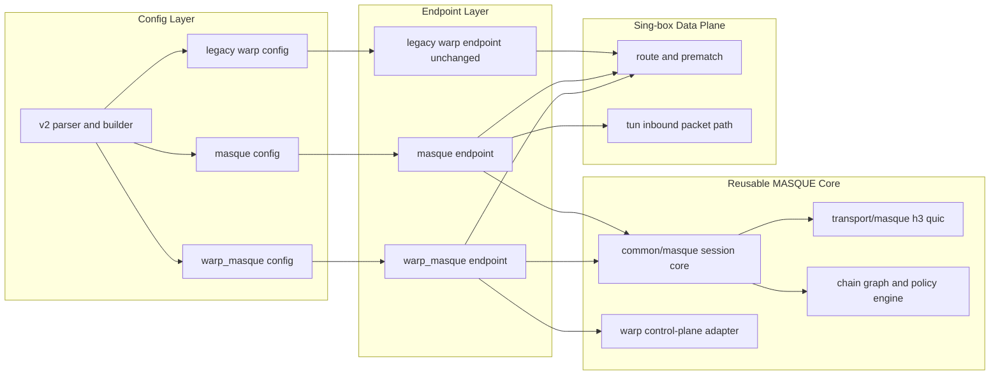

# MASQUE and WARP-MASQUE Architecture (hiddify-core)

## Scope
This document defines the target architecture for adding two **new** endpoints in `hiddify-core`:

- `masque` (generic MASQUE endpoint)
- `warp_masque` (Cloudflare WARP-compatible endpoint on the same MASQUE core)

Legacy `warp` stays unchanged and runs in parallel.

## Goals
- Add MASQUE transport to sing-box data plane in endpoint form.
- Reuse one MASQUE core across `masque` and `warp_masque`.
- Keep strict no-break behavior for legacy `warp`.
- Support MASQUE chaining model (single-hop and multi-hop policy model).
- Preserve sing-box semantics and lifecycle patterns.

## Non-Goals
- Replacing or refactoring legacy `protocol/wireguard/endpoint_warp.go`.
- Changing client/panel behavior in this phase.
- Implementing all runtime chaining optimizations in the first PR set.

## Current Baseline (Relevant)

### Endpoint contract
`adapter.Endpoint` is lifecycle + outbound behavior:

```10:15:hiddify-core/hiddify-sing-box/adapter/endpoint.go
type Endpoint interface {
	Lifecycle
	Type() string
	Tag() string
	Outbound
}
```

### Legacy WARP semantics (authorregistration parity source)
Current `warp` endpoint performs profile acquisition and registration logic inside endpoint path:

- `GetWarpProfileDialer` calls `api.GetProfile(...)` when id/token exist.
- Else it calls `api.CreateProfileLicense(...)`, which creates device profile and optional license update.

```182:189:hiddify-core/hiddify-sing-box/protocol/wireguard/endpoint_warp.go
func GetWarpProfileDialer(ctx context.Context, dialer N.Dialer, profile *option.WARPProfile) (*cloudflare.CloudflareProfile, error) {
	api := cloudflare.NewCloudflareApiDetour(dialer)
	if profile.AuthToken != "" && profile.ID != "" {
		return api.GetProfile(ctx, profile.AuthToken, profile.ID)
	} else {
		return api.CreateProfileLicense(ctx, profile.PrivateKey, profile.License)
	}
}
```

This means **registration is embedded in endpoint/core path today**.

### Endpoint registration pattern
WireGuard and legacy WARP endpoints are registered under endpoint registry:

```15:18:hiddify-core/hiddify-sing-box/include/wireguard.go
func registerWireGuardEndpoint(registry *endpoint.Registry) {
	wireguard.RegisterEndpoint(registry)
	wireguard.RegisterWARPEndpoint(registry)
}
```

## Architecture Decision Summary

1. Add **new endpoint types** (`masque`, `warp_masque`) without touching legacy `warp`.
2. Build shared runtime in `common/masque` + `transport/masque`.
3. Keep WARP compatibility in `warp_masque` only.
4. By parity rule with current semantics, implement **embedded registration flow** in `warp_masque` endpoint path.
5. Keep config and runtime fully parallel: old and new endpoints can coexist.

## Target Topology



## Layered Design

## 1) `common/masque`
Responsibilities:
- Session state machine (`init`, `connecting`, `ready`, `degraded`, `reconnecting`, `closed`).
- Capability model:
  - `connect_udp`
  - `connect_ip`
  - `auto`
- Chain graph model (nodes/hops/egress policy), independent from wire implementation.
- Retry, backoff, health probing, failover policy.
- Error taxonomy normalized for endpoint layer.

Must not import sing-box router internals.

## 2) `transport/masque`
Responsibilities:
- HTTP/3 + QUIC transport handling.
- MASQUE methods:
  - CONNECT-UDP
  - CONNECT-IP
- Datagrams/streams, flow control, keepalive, path migration hooks.
- Fallback policy hooks (`h3`, optional `h2/tcp` where supported by policy).

Dependency boundary:
- Library-specific APIs stay here (`quic-go/masque-go`, `connect-ip-go`).
- Endpoint/config layer receives abstract interfaces only.

## 3) `protocol/masque`

### `endpoint.go` (`type: masque`)
Responsibilities:
- Implements `adapter.Endpoint` lifecycle:
  - `Start`
  - `Close`
  - `DialContext`
  - `ListenPacket`
- Integrates with route/TUN semantics through endpoint/outbound interfaces.
- Uses chain policy and transport mode from config.

### `endpoint_warp_masque.go` (`type: warp_masque`)
Responsibilities:
- Reuses same MASQUE core and transport.
- Adds Cloudflare-specific control-plane behavior.
- Keeps WARP-compatible config and bootstrap semantics.

Important:
- No references to legacy `endpoint_warp.go` path.
- Shared code only through `common/masque` and dedicated cloudflare adapter package.

## Control-plane and Registration Policy

## Parity Decision (resolved)
Rule: if legacy WARP has embedded registration in endpoint path, `warp_masque` must keep embedded registration semantics.

Result: **embedded registration is required** for `warp_masque` in core, because current `warp` does it via endpoint flow.

## `warp_masque` control-plane behavior
- If id/token are provided, attempt profile fetch/refresh.
- If not provided, perform registration/create profile flow.
- Cache profile/state through core cache mechanisms, with explicit versioned schema.
- Support detour-aware control-plane requests (consistent with current outbound detour semantics).

## Config Model (Draft)

## Endpoint `masque`
- Generic fields:
  - `server`
  - `server_port`
  - `transport_mode`: `connect_udp | connect_ip | auto`
  - `tcp_mode`: `strict_masque | masque_or_direct`
  - `tcp_transport`: `connect_ip | connect_stream | auto`
  - `template_tcp`
  - `chain`: optional hop list and selection policy
  - `detour`
  - `mtu` (`connect_ip` datagram ceiling, validated in `[1280, 65535]`)
  - `udp_timeout` / `workers` (not supported; fail-fast)

## Endpoint `warp_masque`
- WARP-focused fields:
  - `profile.id`
  - `profile.auth_token`
  - `profile.license`
  - `profile.private_key` (if required by control-plane flavor)
  - `detour`
  - optional explicit server override
  - `transport_mode` with safe defaults for Cloudflare compatibility

## Chaining Model
- First-class chain graph in config and core.
- Must support:
  - single-hop (default)
  - explicit multi-hop chain
- Routing policy binds traffic classes to chain profiles.
- Endpoint API remains stable even if runtime chain scheduling evolves.

## Data Plane Integration Notes
- Endpoint must behave as outbound-compatible transport for route selection.
- Tun overlay path uses endpoint `ListenPacket` behavior; MASQUE endpoint must provide robust packet mode.
- PreMatch-driven policy remains unchanged from router perspective.

## TUN → rules → `masque` endpoint (tracing hook points)

The sing-box core **router** (`adapter.Router` / route table) resolves traffic after TUN/sniff/metadata assembly. The full router implementation ships with upstream **sing-box**; this fork patches MASQUE endpoints and transport only. Contractually, when routing selects an **endpoint** tag (`detour` / default endpoint for a route), the process invokes that endpoint’s **`Outbound`** surface (`DialContext`, `ListenPacket`, etc.), same as for a classical outbound.

**Stable hook points for debugging packet vs stream paths (client `masque`):**

| Hop | Location | Responsibility |
|-----|----------|----------------|
| 1 | [`protocol/masque/endpoint.go`](hiddify-core/hiddify-sing-box/protocol/masque/endpoint.go) `DialContext`, `ListenPacket` | Thin adapter → `Runtime` |
| 2 | [`common/masque/runtime.go`](hiddify-core/hiddify-sing-box/common/masque/runtime.go) `DialContext`, `ListenPacket`, `OpenIPSession` | Session + chain; eagerly opens IP plane when `transport_mode=connect_ip` |
| 3 | [`transport/masque/transport.go`](hiddify-core/hiddify-sing-box/transport/masque/transport.go) `coreSession.DialContext`, `ListenPacket`, `openIPSessionLocked` | CONNECT-UDP vs CONNECT-IP bridge vs `dialTCPStream` |

Server-side CONNECT-IP ingress dispatches immediately into packet routing via `RoutePacketConnectionEx` in [`protocol/masque/endpoint_server.go`](hiddify-core/hiddify-sing-box/protocol/masque/endpoint_server.go) (`routePacketConnectionExBypassTunnelWrapper`).

## Dataplane mode ↔ layer matrix (client `type: masque`)

| Config / mode | `protocol/masque` | `common/masque` | `transport/masque` | Wire primitive |
|---------------|-------------------|-----------------|--------------------|----------------|
| `transport_mode=connect_udp` | delegates `ListenPacket` | session | `qmasque` + UDP template | RFC 9298 CONNECT-UDP |
| `transport_mode=connect_ip` (`ListenPacket` UDP façade) | same | opens `OpenIPSession` at runtime start | IPv4 UDP ↔ IP tunnel `newConnectIPUDPPacketConn` | RFC 9484 + UDP-in-tunnel bridging |
| `transport_mode=connect_ip` (TCP via userspace stack) | `DialContext` | reuses cached IP plane | netstack TCP over `IPPacketSession` | CONNECT-IP packet plane + stack dial |
| `tcp_transport=connect_stream` | `DialContext` | session | `dialTCPStream` (HTTP/3 CONNECT) | Stream relay to template target |
| `tcp_transport=connect_ip` (client) | **rejected at** `validateMasqueOptions` | — | — | Use `connect_stream` for TCP; IP-plane TCP uses stack |

`fallback_policy=direct_explicit` affects **`DialContext`** via runtime/transport policy contract (`protocol/masque/endpoint.go` + `transport/masque/transport.go`); it does **not** build parallel CONNECT-UDP / CONNECT-IP sessions for `ListenPacket`.

## Cloudflare / WARP isolation (baseline audit)

- **Generic MASQUE** (`transport/masque`, `protocol/masque/endpoint.go`, `endpoint_server.go`) carries **no** Cloudflare bootstrap, `cf-connect-*` protocol strings, or WARP cache paths.
- **Provider-specific** code is limited to [`protocol/masque/endpoint_warp_masque.go`](hiddify-core/hiddify-sing-box/protocol/masque/endpoint_warp_masque.go) and [`protocol/masque/warp_control_adapter.go`](hiddify-core/hiddify-sing-box/protocol/masque/warp_control_adapter.go) (`CloudflareWarpControlAdapter`).

## Compatibility and Rollout
- Legacy `warp` untouched.
- New endpoints added side-by-side.
- No aliasing or hidden migration from `warp` to `warp_masque`.
- Feature gates for new endpoint types allowed, but default behavior of legacy path must not change.

## Implementation Status (Production Closure Track)
- Added endpoint types, registry wiring and build-tag stubs:
  - `masque`
  - `warp_masque`
- Added runtime stateful core (`common/masque`) with readiness derived from session start result.
- Added local transport-core vendor baseline and bridge integration:
  - `third_party/masque-go` for CONNECT-UDP
  - `third_party/connect-ip-go` for CONNECT-IP
- Refactored `transport/masque` contracts to expose explicit capability model and separate CONNECT-IP session semantics.
- Added strict fallback policy (`strict` by default, explicit direct fallback opt-in).
- Added dedicated Cloudflare control adapter for `warp_masque` bootstrap parity, isolating provider-specific logic from protocol endpoint lifecycle.
- Added chain graph validation in runtime preparation (`via` references, duplicate tags, cycle guard) for deterministic single-hop/multi-hop execution order.
- Added endpoint shape `mode=client|server` for `masque`; server mode starts an HTTP/3 MASQUE endpoint lifecycle with CONNECT-UDP and CONNECT-IP handlers.
- Server-mode now bridges CONNECT-IP sessions into sing-box packet routing path via endpoint metadata and router dispatch.

## Release Contract Matrix

| Area | Scope | Status |
|---|---|---|
| RFC 9298 | CONNECT-UDP client path via `masque-go` | Implemented |
| RFC 9484 | CONNECT-IP client/server path via `connect-ip-go` | Implemented |
| Fallback contract | fail-closed default, `direct_explicit` opt-in only | Implemented |
| TCP policy contract | `tcp_mode=strict_masque|masque_or_direct` with policy fallback only when explicitly enabled | Implemented |
| TCP transport selection | Client: `connect_stream` only; `connect_ip`/`auto` TCP modes rejected (`validateMasqueOptions`); IP-plane TCP uses netstack under `transport_mode=connect_ip` | Implemented |
| Capability contract | backend capabilities reflect real implementation | Implemented |
| Config effect | `transport_mode`, `template_udp`, `template_ip`, `fallback_policy`, `tls_server_name`, `insecure` affect runtime behavior | Implemented |
| Data-plane detour | runtime supports route-aware QUIC dial hook from endpoint dialer options when dialer context is available | Implemented (fail-fast for custom dialer options; direct default for zero dialer options) |
| Chain graph | validation (`via`, duplicates, cycles) and deterministic entry-hop selection | Implemented (runtime orchestration limited) |
| `warp_masque` parity | bootstrap through dedicated Cloudflare adapter; deterministic server/port resolution; versioned cache-based reuse path | Implemented |
| Legacy `warp` | no code-path modification | Preserved |
| Warp lifecycle diagnostics | startup errors are observable by endpoint callers and readiness remains false on startup failure | Implemented |

Current production-track limits:
- **TUN-only client**: `tcp_transport=connect_ip` is **rejected** at endpoint validation; production TCP relay uses **`connect_stream`** + `template_tcp`. TCP over **`transport_mode=connect_ip`** goes through the **packet plane + netstack** (`OpenIPSession` / adapter), not a separate CONNECT-IP “TCP mux” dial.
- `tcp_transport=connect_stream` is available for the H3 CONNECT stream path via `template_tcp` and advertises `ConnectTCP` capability when normalized.
- Chain runtime now supports ordered hop failover progression, while advanced per-hop forwarding policies remain follow-up work.
- Security defaults are production-safe (no insecure TLS by default), while custom trust/pinning extensions remain follow-up work.
- Route-aware QUIC dial hook is strict for non-default dialer options and surfaces typed initialization errors instead of silent degrade.
- Server mode now supports optional `server_token` auth guard and `allow_private_targets` toggle to reduce open-relay/SSRF risk for TCP CONNECT target dialing.
- Client mode can pass `server_token` as bearer authorization for TCP CONNECT stream contract compatibility with server auth guard.
- `warp_masque` uses async startup semantics (parity with legacy endpoint style), so control-plane errors surface on first operational calls when startup fails.
- **Bootstrap / runtime start:** `ResolveServer` and `Runtime.Start` run with bounded retries and jittered backoff on transient failures; generic `masque` passes the router start context into `Runtime.Start` so cancellation can interrupt an in-flight session dial.
- **Runtime diagnostics:** shared `common/masque.Runtime` exposes `LifecycleState()` and `LastError()` in addition to `IsReady()` (see `runtime.go`); `warp_masque` still stores the last async startup error for `DialContext`/`ListenPacket` when the runtime handle is not yet installed.

## RC Gate Commands

- `go test ./protocol/masque ./transport/masque ./common/masque ./include -tags with_masque`
- `go test -race ./protocol/masque -tags with_masque`
- `go mod verify`

## Operator TCP Matrix

Applies when **`tcp_transport=connect_stream`** (only value accepted for MASQUE **stream** TCP in TUN-only **client** mode). Rows using `tcp_transport=connect_ip` or `auto` as **explicit TCP mux** are invalid for clients—see [`protocol/masque/endpoint.go`](hiddify-core/hiddify-sing-box/protocol/masque/endpoint.go) validation and the matrix above.

| `tcp_transport` | `tcp_mode` | `fallback_policy` | Behavior |
|---|---|---|---|
| `connect_stream` | `strict_masque` | `strict` | MASQUE TCP only (`dialTCPStream`), fail-closed |
| `connect_stream` | `masque_or_direct` | `direct_explicit` | MASQUE TCP first; on typed fallback path → direct TCP |
| ~~`connect_ip` (client TCP mux)~~ | — | — | **Rejected**: use `transport_mode=connect_ip` + netstack for TCP, or `connect_stream` |
| ~~`auto`~~ | — | — | **Rejected** in production client profiles |

## Testing Strategy

## Contract Tests
- Freeze current `warp` behavior snapshots (startup, profile bootstrap, readiness, error mapping).
- Verify no regression in legacy path.

## Endpoint Integration Tests
- `masque`: dial/listen, connect modes, route policy.
- `warp_masque`: registration bootstrap, token reuse path, detour path, reconnect.

## Chaining Tests
- Config validation for chain graph.
- Single-hop and multi-hop route binding.
- Failure propagation and failover behavior.

## E2E
- Route + tun packet flows.
- Fallback and reconnect scenarios.
- Parallel operation with legacy `warp`.

## MTU and CONNECT-IP ceiling (warp_masque parity)

- Generic `masque` maps outbound `mtu` into `ConnectIPDatagramCeiling` for the shared `CoreClientFactory` session (`protocol/masque/endpoint.go`).
- `warp_masque` uses the same mapping: `MasqueEndpointOptions.MTU` is propagated on startup via `RuntimeOptions.ConnectIPDatagramCeiling` (`protocol/masque/endpoint_warp_masque.go`), so CONNECT-IP / datagram ceiling behavior matches generic `masque` for the same JSON `mtu`.
- Upper clamp for the effective ceiling in transport defaults to **1500**; lab override: environment variable **`HIDDIFY_MASQUE_DATAGRAM_CEILING_MAX`** (see `IDEAL-MASQUE-ARCHITECTURE.md`).

## Risks and Mitigations
- Cloudflare behavior can diverge from RFC details.
  - Mitigation: isolate cloudflare adapter; keep transport generic.
- Chaining complexity can delay runtime maturity.
  - Mitigation: stabilize API/model now, phase runtime optimizations.
- Cache/schema drift.
  - Mitigation: versioned cache format for `warp_masque` profile state.

## Implementation Work Packages
1. Add constants/options for `masque` and `warp_masque`.
2. Implement `common/masque` core contracts.
3. Implement `transport/masque` abstraction + baseline runtime.
4. Implement `protocol/masque/endpoint.go`.
5. Implement `protocol/masque/endpoint_warp_masque.go` with embedded registration parity.
6. Add config parser/builder support for new endpoint types.
7. Add tests (contract/integration/e2e/chaining).
8. Document operator guidance and known limits.

